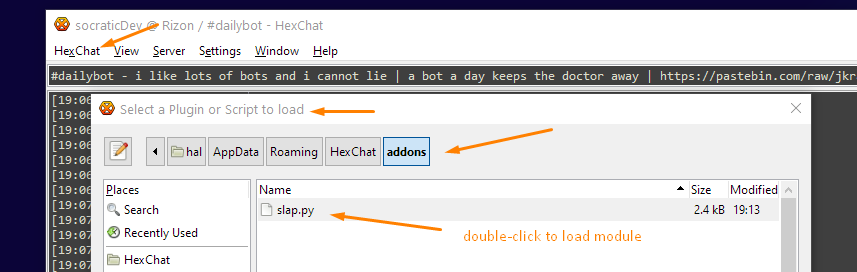

 
# hexchat_plugins - Slap! Love!!
🐒✨ fun python plugins for IRC client HexChat ✨🐒

> Spice up IRC convos with __/slap__ and __/love__ actions. 

Do you prefer being mischevious in 🇫🇷french🇫🇷 or 🇱🇺Luxembourgish🇱🇺 append ``fr`` or ``lu`` to the action word.

## How to install plugin ``slap.py``

On Windows : 
(prerequisite: you must have enabled and installed Python when you installed HexChat. If not, safely re-install HexChat and, when prompted, enable Python 3.x and install Python)

1- press <kbd></kbd> + <kbd>R</kbd> and type ``%appdata%`` and press <kbd>Enter</kbd>

2- Look for this directory : ``HexChat\addons``

3- paste the ``slap.py`` file in this directory.

4- In HexChat, click ``HexChat`` menu -> ``Load plugins`` -> ``addons`` tab -> double-click on ``slap.py`` to enable your plugin

## Instructions

``/slap joe`` will slap user _joe_ in english🐡🇺🇸🐡🇬🇧🐡🇨🇦🐡🇦🇺🐡

``/slapfr Amélie`` will slap user _Amélie_ in french 🐡🇫🇷🐡

``/slaplu ToxicRené`` will slap user _ToxicRené_ in luxembourguish🐡🇱🇺🐡

same for ``/love`` command ❤️🌎❤️

## Original script

[https://github.com/hexchat/hexchat-addons/tree/master/python/slap](https://github.com/hexchat/hexchat-addons/tree/master/python/slap)
